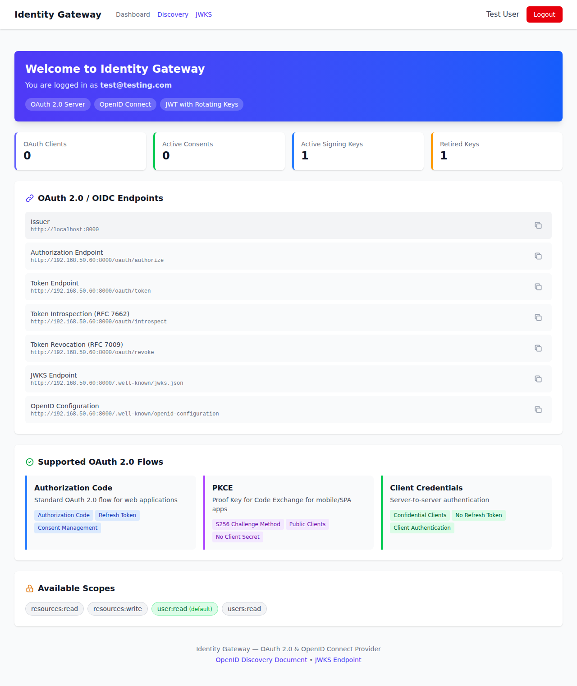

# Screenshots

This directory contains screenshots of the Identity Gateway application.

## Dashboard

The main dashboard provides an overview of OAuth endpoints, active statistics, and supported flows:

### Dashboard Features

- **Welcome Banner**: Shows logged-in user and key features (OAuth 2.0 Server, OpenID Connect, JWT with Rotating Keys)
- **Statistics Cards**: Quick overview of OAuth Clients, Active Consents, and Signing Keys
- **OAuth 2.0 / OIDC Endpoints**: All available endpoints including:
  - Issuer
  - Authorization Endpoint
  - Token Endpoint
  - Token Introspection (RFC 7662)
  - Token Revocation (RFC 7009)
  - JWKS Endpoint
  - OpenID Configuration
- **Supported OAuth 2.0 Flows**:
  - Authorization Code
  - PKCE (Proof Key for Code Exchange)
  - Client Credentials
- **Available Scopes**: List of defined OAuth scopes
