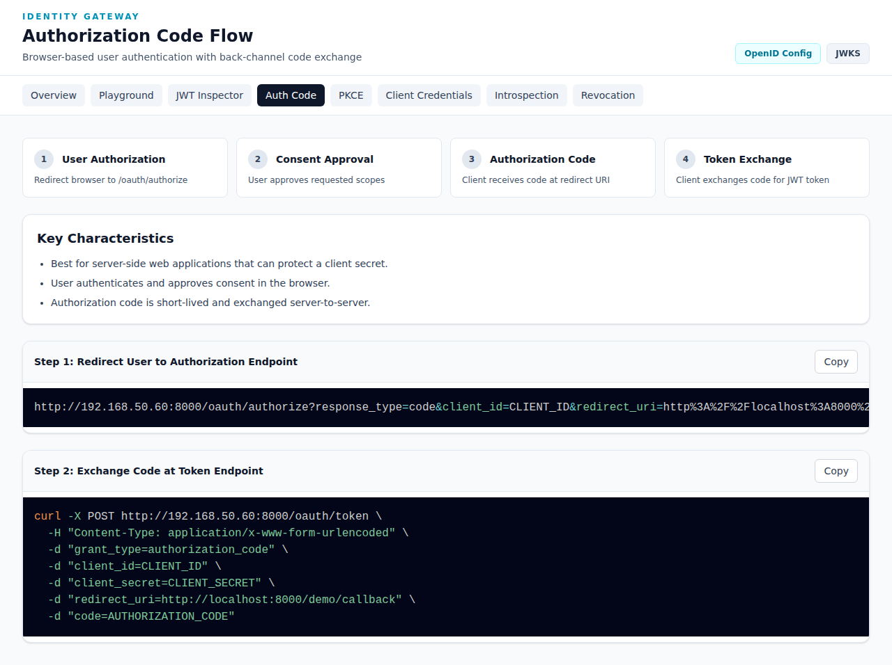

# Authorization Code Flow

The **Authorization Code Flow** documentation demonstrates browser-based user authentication with back-channel code exchange.

**URL**: `http://192.168.50.60:8000/demo/flows/auth-code`



## Overview

The Authorization Code flow is the most common OAuth2 grant type for server-side web applications that can protect a client secret.

### Key Characteristics

- ✅ Best for server-side web applications that can protect a client secret
- ✅ User authenticates and approves consent in the browser
- ✅ Authorization code is short-lived and exchanged server-to-server

## Flow Steps

```
┌─────────┐                    ┌──────────────┐
│  User   │──1. Authorization──▶│ Authorization│
│ Browser │                    │   Server     │
│         │◀──2. Redirect──────│              │
│         │   with code        │              │
│         │                    │              │
│  Client │──3. Exchange──────▶│   Token      │
│ Server  │   code for token   │   Server     │
│         │◀──4. JWT Token─────│              │
└─────────┘                    └──────────────┘
```

### Step 1: User Authorization
Redirect browser to `/oauth/authorize`

### Step 2: Consent Approval
User approves requested scopes

### Step 3: Authorization Code
Client receives code at redirect URI

### Step 4: Token Exchange
Client exchanges code for JWT token

## Implementation Guide

### Step 1: Redirect User to Authorization Endpoint

```
http://192.168.50.60:8000/oauth/authorize?response_type=code&client_id=CLIENT_ID&redirect_uri=http%3A%2F%2Flocalhost%3A8000%2Fdemo%2Fcallback&scope=resources%3Aread+user%3Aread&state=RANDOM_STATE
```

**Parameters:**
| Parameter | Description |
|-----------|-------------|
| `response_type` | Must be `code` |
| `client_id` | Your registered client ID |
| `redirect_uri` | Must match registered URI |
| `scope` | Space-separated scope list |
| `state` | CSRF protection (recommended) |

### Step 2: Exchange Code at Token Endpoint

```bash
curl -X POST http://192.168.50.60:8000/oauth/token \
  -H "Content-Type: application/x-www-form-urlencoded" \
  -d "grant_type=authorization_code" \
  -d "client_id=CLIENT_ID" \
  -d "client_secret=CLIENT_SECRET" \
  -d "redirect_uri=http://localhost:8000/demo/callback" \
  -d "code=AUTHORIZATION_CODE"
```

**Response:**
```json
{
  "access_token": "eyJhbGciOiJSUzI1NiIs...",
  "token_type": "Bearer",
  "expires_in": 3600,
  "scope": "resources:read user:read"
}
```

## Security Considerations

- 🔒 **Client Secret** must never be exposed to the browser
- 🔒 **State Parameter** prevents CSRF attacks
- 🔒 **Short-lived Codes** expire quickly if intercepted
- 🔒 **HTTPS Required** in production

## When to Use

Use Authorization Code flow when:
- You have a server-side application
- You can securely store a client secret
- User authentication is required
- You need delegated access to user resources

## Try It

1. Go to the [OAuth Playground](./playground.md)
2. Select "Authorization Code" grant type
3. Choose scopes and click "Start Authorization Redirect"
4. Login with demo credentials
5. Observe the complete flow
