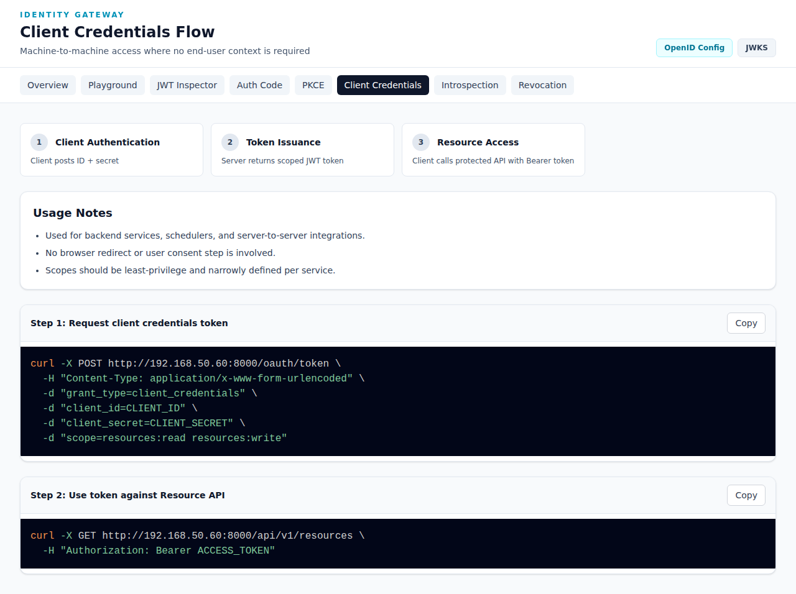

# Client Credentials Flow

The **Client Credentials Flow** documentation demonstrates machine-to-machine access where no end-user context is required.

**URL**: `http://192.168.50.60:8000/demo/flows/client-credentials`



## Overview

The Client Credentials flow is used for backend services, schedulers, and server-to-server integrations where a user is not present.

### Key Characteristics

- 🤖 Used for backend services, schedulers, and server-to-server integrations
- 🤖 No browser redirect or user consent step is involved
- 🤖 Scopes should be least-privilege and narrowly defined per service

## Flow Steps

```
┌─────────────┐                    ┌──────────────┐
│   Client    │──1. Auth + Scope──▶│   Token      │
│  Service A  │                    │   Server     │
│             │◀──2. JWT Token─────│              │
│             │                    │              │
│             │──3. API Call───────▶│  Resource    │
│             │   Bearer Token      │   Server     │
│             │◀──4. Data──────────│              │
└─────────────┘                    └──────────────┘
```

### Step 1: Client Authentication
Client posts ID + secret

### Step 2: Token Issuance
Server returns scoped JWT token

### Step 3: Resource Access
Client calls protected API with Bearer token

## Implementation Guide

### Step 1: Request client credentials token

```bash
curl -X POST http://192.168.50.60:8000/oauth/token \
  -H "Content-Type: application/x-www-form-urlencoded" \
  -d "grant_type=client_credentials" \
  -d "client_id=CLIENT_ID" \
  -d "client_secret=CLIENT_SECRET" \
  -d "scope=resources:read resources:write"
```

**Parameters:**
| Parameter | Description |
|-----------|-------------|
| `grant_type` | Must be `client_credentials` |
| `client_id` | Your registered client ID |
| `client_secret` | Your client secret |
| `scope` | Space-separated scope list (optional) |

**Response:**
```json
{
  "access_token": "eyJhbGciOiJSUzI1NiIs...",
  "token_type": "Bearer",
  "expires_in": 3600,
  "scope": "resources:read resources:write"
}
```

### Step 2: Use token against Resource API

```bash
curl -X GET http://192.168.50.60:8000/api/v1/resources \
  -H "Authorization: Bearer ACCESS_TOKEN"
```

## When to Use

Use Client Credentials when:
- A service needs to access its own resources
- No user is present or involved
- Machine-to-machine communication
- Scheduled/automated tasks
- Microservice-to-microservice calls

### Common Use Cases

| Use Case | Example |
|----------|---------|
| Data Sync | Nightly ETL jobs |
| Microservices | Service A calling Service B |
| Automation | CI/CD pipelines |
| Monitoring | Health check scripts |
| Reporting | Analytics aggregation |

## Security Considerations

- 🔒 Store client secrets securely (environment variables, secrets managers)
- 🔒 Use least-privilege scopes
- 🔒 Rotate client secrets regularly
- 🔒 Monitor token usage for anomalies
- 🔒 Never expose client secrets in client-side code

## Comparison with Other Flows

| Feature | Auth Code | PKCE | Client Credentials |
|---------|-----------|------|-------------------|
| User Present | Yes | Yes | No |
| Client Secret | Required | Optional | Required |
| Redirect URI | Required | Required | Not used |
| Use Case | Web apps | Mobile/SPA | Backend services |

## Scope Best Practices

Since Client Credentials tokens often have elevated access:

1. **Narrow Scopes** - Only request what's needed
2. **Service-Specific Clients** - Create separate clients per service
3. **Time-Limited** - Use short expiration times
4. **Monitor Usage** - Log and audit token usage

## Try It

1. Go to the [OAuth Playground](./playground.md)
2. Select "Client Credentials" grant type
3. Choose your desired scopes
4. Click "Start Authorization Redirect"
5. Token is issued immediately - no user login required!

## Example: Complete Service Integration

```python
import requests

# 1. Get token
token_response = requests.post(
    'http://192.168.50.60:8000/oauth/token',
    data={
        'grant_type': 'client_credentials',
        'client_id': 'my-service',
        'client_secret': 'secret123',
        'scope': 'resources:read'
    }
)
token = token_response.json()['access_token']

# 2. Use token
api_response = requests.get(
    'http://192.168.50.60:8000/api/v1/resources',
    headers={'Authorization': f'Bearer {token}'}
)
print(api_response.json())
```
