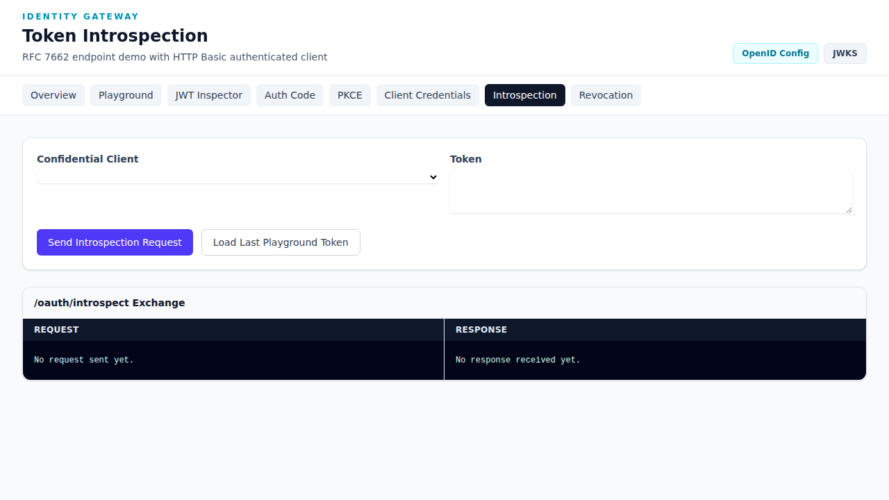

# Token Introspection

The **Token Introspection** demo allows you to send RFC 7662 introspection requests with HTTP Basic client authentication.

**URL**: `http://192.168.50.60:8000/demo/introspection`



## Overview

Token introspection allows authorized clients to query the authorization server about the current state of an access token, including whether it's active, its scopes, and associated metadata.

### RFC 7662

This demo implements RFC 7662 - OAuth 2.0 Token Introspection, which defines a method for a protected resource to query an OAuth 2.0 authorization server to determine the active state of an OAuth 2.0 token.

## How to Use

### Step 1: Configure the Request

1. **Select Confidential Client** from the dropdown
   - Choose a client with introspection permissions
   - The client ID and secret will be used for HTTP Basic auth

2. **Enter Token** in the Token field
   - Paste an access token
   - Or click "Load Last Playground Token" to use the most recent token

### Step 2: Send the Request

Click **"Send Introspection Request"**

### Step 3: View Results

The **Request/Response** panel displays:
- **Request**: The HTTP POST to `/oauth/introspect`
- **Response**: The introspection result

## Introspection Response

### Active Token Response

```json
{
  "active": true,
  "scope": "resources:read user:read",
  "client_id": "demo-client",
  "token_type": "Bearer",
  "exp": 1234567890,
  "iat": 1234564000,
  "sub": "user-id",
  "iss": "http://192.168.50.60:8000"
}
```

### Inactive/Revoked Token Response

```json
{
  "active": false
}
```

## Response Fields

| Field | Description |
|-------|-------------|
| `active` | Boolean indicating if token is valid |
| `scope` | Granted scopes |
| `client_id` | Client that requested the token |
| `token_type` | Type of token (Bearer) |
| `exp` | Expiration timestamp |
| `iat` | Issued at timestamp |
| `sub` | Subject (user ID) |
| `iss` | Token issuer |

## Implementation Details

### HTTP Basic Authentication

The introspection endpoint requires HTTP Basic auth:
```
Authorization: Basic base64(client_id:client_secret)
```

### cURL Example

```bash
curl -X POST http://192.168.50.60:8000/oauth/introspect \
  -u "CLIENT_ID:CLIENT_SECRET" \
  -d "token=ACCESS_TOKEN"
```

### Full Request/Response

**Request:**
```http
POST /oauth/introspect HTTP/1.1
Host: 192.168.50.60:8000
Authorization: Basic ZGVtbzpkZW1v
echo "Content-Type: application/x-www-form-urlencoded"

token=eyJhbGciOiJSUzI1NiIs...
```

**Response:**
```http
HTTP/1.1 200 OK
Content-Type: application/json

{
  "active": true,
  "scope": "resources:read",
  "client_id": "demo-client",
  "token_type": "Bearer",
  "exp": 1710840000,
  "sub": "user-123"
}
```

## When to Use Introspection

Use token introspection when:
- A resource server needs to validate tokens
- You want to check token metadata
- Implementing token blacklisting
- Auditing token usage
- Verifying token scope requirements

### Resource Server Flow

```
┌────────────────┐                    ┌──────────────┐
│  Resource      │──1. API Call───────▶│  Resource    │
│  Client        │   with token        │  Server      │
│                │                    │              │
│                │                    │──2. Introspect─▶│
│                │                    │   token         │ Auth Server
│                │                    │◀─3. Active?────│
│                │◀──4. Response──────│              │
└────────────────┘                    └──────────────┘
```

## Security Considerations

- 🔒 Only confidential clients can introspect tokens
- 🔒 Use HTTPS in production
- 🔒 Cache introspection results briefly to reduce server load
- 🔒 Don't expose introspection endpoints publicly

## Tips

- Use "Load Last Playground Token" for quick testing
- Compare active vs revoked tokens
- Check the scope field to verify permission levels
- The introspection endpoint is at `/oauth/introspect`
