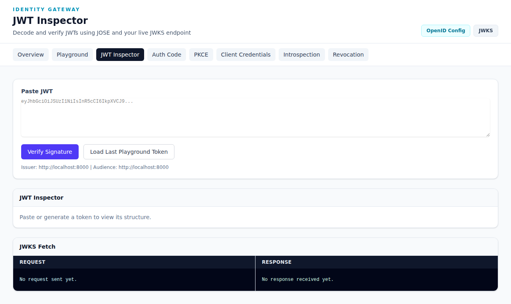

# JWT Inspector

The **JWT Inspector** allows you to decode and verify JWTs using JOSE and the live JWKS endpoint.

**URL**: `http://192.168.50.60:8000/demo/jwt-inspector`



## Overview

This tool helps you:
- Decode JWT token segments (header, payload, signature)
- Verify token signatures against live JWKS
- Debug token issues
- Inspect tokens generated from the playground

## How to Use

### Option 1: Paste a JWT

1. Paste a complete JWT string in the **"Paste JWT"** textarea
2. Click **"Verify Signature"**
3. View the decoded segments and verification result

### Option 2: Load from Playground

1. Click **"Load Last Playground Token"**
2. The most recent token from the OAuth Playground is automatically loaded
3. View the decoded JWT structure

## Understanding the Display

### JWT Inspector Panel

Shows the three JWT segments:

**Header** (decoded):
```json
{
  "alg": "RS256",
  "typ": "JWT"
}
```

**Payload** (decoded claims):
```json
{
  "iss": "http://localhost:8000",
  "aud": "http://localhost:8000",
  "sub": "user-id",
  "scope": "resources:read user:read",
  "exp": 1234567890
}
```

**Signature**: Verified against the live JWKS endpoint

### JWKS Fetch Panel

Shows the request/response when fetching signing keys:
- **Request**: GET to `/.well-known/jwks.json`
- **Response**: Public RSA keys in JWKS format

## Token Verification

The inspector validates:
- ✅ Signature matches the signing key
- ✅ Token has not expired
- ✅ Issuer matches expected value
- ✅ Audience matches expected value

## Common Use Cases

1. **Debug Token Issues** - Paste a failing token to see its claims
2. **Verify Playground Tokens** - Confirm tokens are properly signed
3. **Learn JWT Structure** - See how tokens are constructed
4. **Test JWKS Endpoint** - Verify the key endpoint is working

## Example Token Structure

A typical access token contains:

| Claim | Meaning |
|-------|---------|
| `iss` | Issuer (Identity Gateway URL) |
| `aud` | Audience (intended recipient) |
| `sub` | Subject (user ID) |
| `scope` | Granted permissions |
| `exp` | Expiration timestamp |
| `iat` | Issued at timestamp |
| `jti` | Unique token ID |

## Tips

- Use the "Load Last Playground Token" button for convenience
- Check the JWKS Fetch panel if signature verification fails
- Expired tokens will show verification warnings
- The raw JWT string is displayed for copying to other tools
