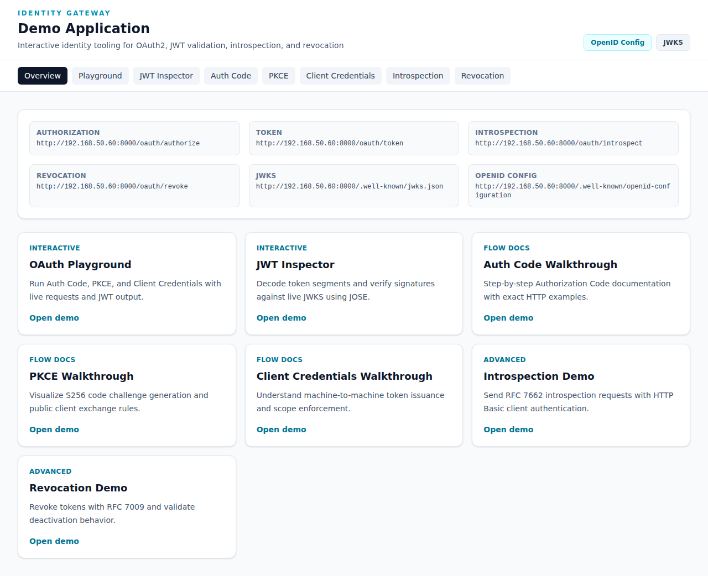

# Identity Gateway Demo Manual

Welcome to the **Identity Gateway Demo Application** manual. This guide provides step-by-step instructions for using each interactive demo tool available at `http://192.168.50.60:8000/demo`.

## Table of Contents

1. [Overview](#overview)
2. [OAuth Playground](./playground.md) - Interactive token requests
3. [JWT Inspector](./jwt-inspector.md) - Decode and verify JWTs
4. [Auth Code Flow](./auth-code.md) - Authorization Code walkthrough
5. [PKCE Flow](./pkce.md) - PKCE flow documentation
6. [Client Credentials Flow](./client-credentials.md) - Machine-to-machine tokens
7. [Token Introspection](./introspection.md) - RFC 7662 introspection
8. [Token Revocation](./revocation.md) - RFC 7009 revocation

---

## Overview

The **Demo Application** provides interactive tools for understanding OAuth2, JWT validation, introspection, and revocation.

**Live Demo URL**: `http://192.168.50.60:8000/demo`

### Available OAuth2 Endpoints

| Endpoint | URL |
|----------|-----|
| Authorization | `http://192.168.50.60:8000/oauth/authorize` |
| Token | `http://192.168.50.60:8000/oauth/token` |
| Introspection | `http://192.168.50.60:8000/oauth/introspect` |
| Revocation | `http://192.168.50.60:8000/oauth/revoke` |
| JWKS | `http://192.168.50.60:8000/.well-known/jwks.json` |
| OpenID Config | `http://192.168.50.60:8000/.well-known/openid-configuration` |

### Demo Categories

- **Interactive**: Live tools you can use to generate and inspect tokens
- **Flow Docs**: Step-by-step documentation with exact HTTP examples
- **Advanced**: RFC-compliant introspection and revocation demos

---

## Quick Start

1. Navigate to `http://192.168.50.60:8000/demo`
2. Select a demo from the navigation tabs or cards
3. Follow the instructions in each individual guide

### Demo Login Credentials

For flows requiring user authentication:
- **Email**: `demo@identitygateway.test`
- **Password**: `password`

---

## Individual Demo Guides

### [OAuth Playground](./playground.md)
Run real Authorization Code, PKCE, and Client Credentials flows with live requests and JWT output. Perfect for testing different OAuth2 grant types interactively.

### [JWT Inspector](./jwt-inspector.md)
Decode JWT token segments and verify signatures against the live JWKS endpoint using JOSE. Useful for debugging token issues.

### [Auth Code Flow](./auth-code.md)
Step-by-step Authorization Code flow documentation with exact HTTP examples. Best for server-side web applications.

### [PKCE Flow](./pkce.md)
Visualize S256 code challenge generation and public client exchange rules. Essential for mobile and SPA applications.

### [Client Credentials Flow](./client-credentials.md)
Understand machine-to-machine token issuance and scope enforcement. Perfect for backend service integrations.

### [Token Introspection](./introspection.md)
Send RFC 7662 introspection requests with HTTP Basic client authentication. Check if tokens are active and view their metadata.

### [Token Revocation](./revocation.md)
Revoke tokens with RFC 7009 and validate deactivation behavior. Essential for security incident response.

---

## Available Scopes

The demo environment supports the following scopes:

| Scope | Description |
|-------|-------------|
| `resources:read` | Read resources |
| `resources:write` | Create, update, and delete resources |
| `user:read` | Read authenticated user information |
| `users:read` | Read all users (admin only) |

---

## Additional Resources

- [OpenID Config](http://192.168.50.60:8000/.well-known/openid-configuration) - Discovery document
- [JWKS](http://192.168.50.60:8000/.well-known/jwks.json) - Public signing keys
