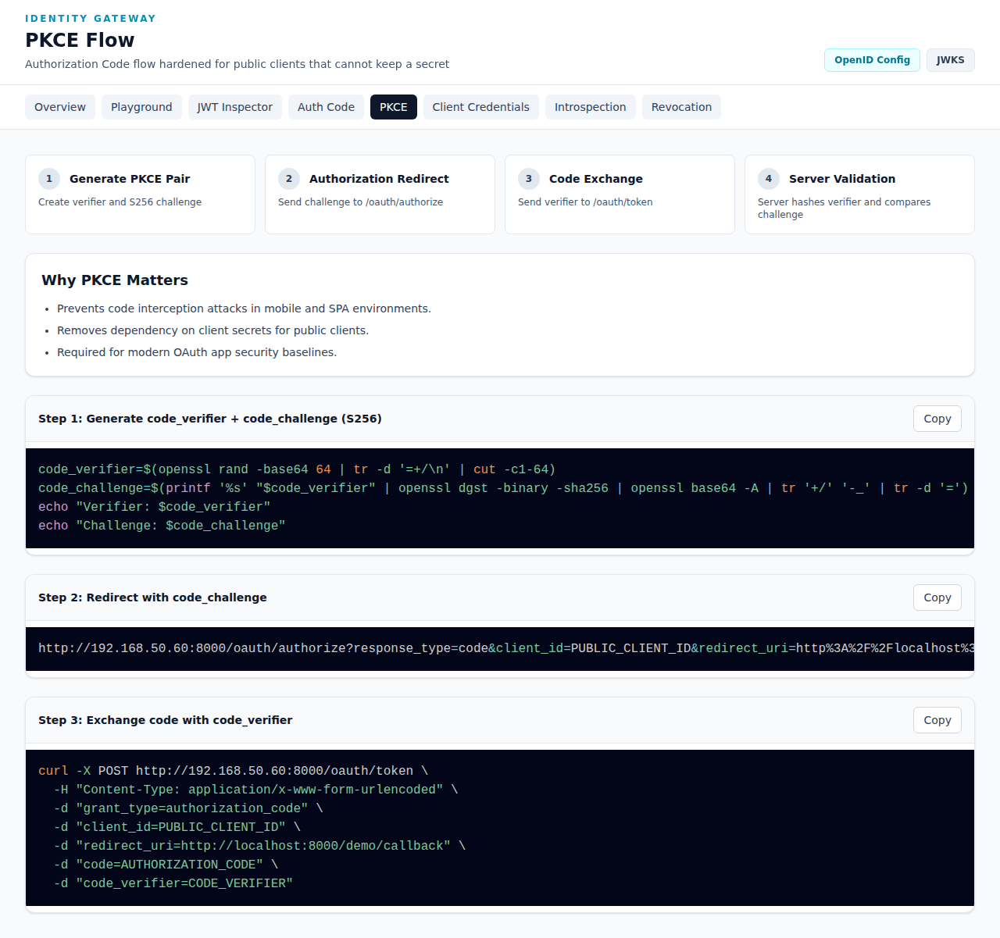

# PKCE Flow

The **PKCE (Proof Key for Code Exchange)** Flow documentation demonstrates the Authorization Code flow hardened for public clients that cannot keep a secret.

**URL**: `http://192.168.50.60:8000/demo/flows/pkce`



## Overview

PKCE (pronounced "pixy") is an extension to the Authorization Code flow that prevents authorization code interception attacks, particularly for mobile apps and single-page applications (SPAs).

### Why PKCE Matters

- ✅ Prevents code interception attacks in mobile and SPA environments
- ✅ Removes dependency on client secrets for public clients
- ✅ Required for modern OAuth app security baselines

## Flow Steps

```
┌─────────┐                    ┌──────────────┐
│  Client │──1. Generate──────▶│   Code       │
│         │   PKCE Pair       │   Verifier   │
│         │                    │  & Challenge │
│         │                    │              │
│  User   │──2. Redirect─────▶│ Authorization│
│ Browser │   with challenge  │   Server     │
│         │◀──3. Redirect──────│              │
│         │   with code        │              │
│         │                    │              │
│  Client │──4. Exchange─────▶│   Token      │
│         │   with verifier   │   Server     │
│         │◀──5. JWT Token─────│              │
└─────────┘                    └──────────────┘
```

### Step 1: Generate PKCE Pair
Create verifier and S256 challenge

### Step 2: Authorization Redirect
Send challenge to `/oauth/authorize`

### Step 3: Code Exchange
Send verifier to `/oauth/token`

### Step 4: Server Validation
Server hashes verifier and compares challenge

## Implementation Guide

### Step 1: Generate code_verifier + code_challenge (S256)

**Bash:**
```bash
code_verifier=$(openssl rand -base64 64 | tr -d '+=/' | cut -c1-64)
code_challenge=$(printf '%s' "$code_verifier" | openssl dgst -binary -sha256 | openssl base64 -A | tr '+/' '-_' | tr -d '=')
echo "Verifier: $code_verifier"
echo "Challenge: $code_challenge"
```

**How it works:**
1. Generate a random 128-character string (code_verifier)
2. Hash it with SHA-256
3. Base64url encode the hash (code_challenge)

### Step 2: Redirect with code_challenge

```
http://192.168.50.60:8000/oauth/authorize?response_type=code&client_id=PUBLIC_CLIENT_ID&redirect_uri=http%3A%2F%2Flocalhost%3A8000%2Fdemo%2Fcallback&code_challenge=GENERATED_CHALLENGE&code_challenge_method=S256&scope=resources%3Aread
```

**New PKCE Parameters:**
| Parameter | Description |
|-----------|-------------|
| `code_challenge` | The SHA-256 hash of verifier |
| `code_challenge_method` | Must be `S256` |

### Step 3: Exchange code with code_verifier

```bash
curl -X POST http://192.168.50.60:8000/oauth/token \
  -H "Content-Type: application/x-www-form-urlencoded" \
  -d "grant_type=authorization_code" \
  -d "client_id=PUBLIC_CLIENT_ID" \
  -d "redirect_uri=http://localhost:8000/demo/callback" \
  -d "code=AUTHORIZATION_CODE" \
  -d "code_verifier=CODE_VERIFIER"
```

**Note:** No client_secret is required!

## Security Benefits

Without PKCE, an attacker who intercepts the authorization code can exchange it for a token. With PKCE:

1. Attacker gets the authorization code
2. But doesn't know the code_verifier
3. Server rejects token exchange (hash doesn't match)
4. Token remains secure

## When to Use

Use PKCE when:
- Building mobile applications
- Building single-page applications (SPAs)
- The client cannot securely store a secret
- You want enhanced security even for confidential clients

## Try It

1. Go to the [OAuth Playground](./playground.md)
2. Select "Authorization Code + PKCE" grant type
3. Click "Start Authorization Redirect"
4. Login with demo credentials
5. Observe the complete PKCE flow

## Comparison: Auth Code vs PKCE

| Feature | Auth Code | PKCE |
|---------|-----------|------|
| Client Secret | Required | Not Required |
| Security Level | Good | Excellent |
| Use Case | Server apps | Mobile/SPA apps |
| Implementation | Simpler | One extra step |

## Best Practices

- Always use PKCE for mobile and SPA applications
- Generate a new code_verifier for every authorization request
- The code_verifier should be cryptographically random
- Store code_verifier securely (memory only, never localStorage for SPAs)
