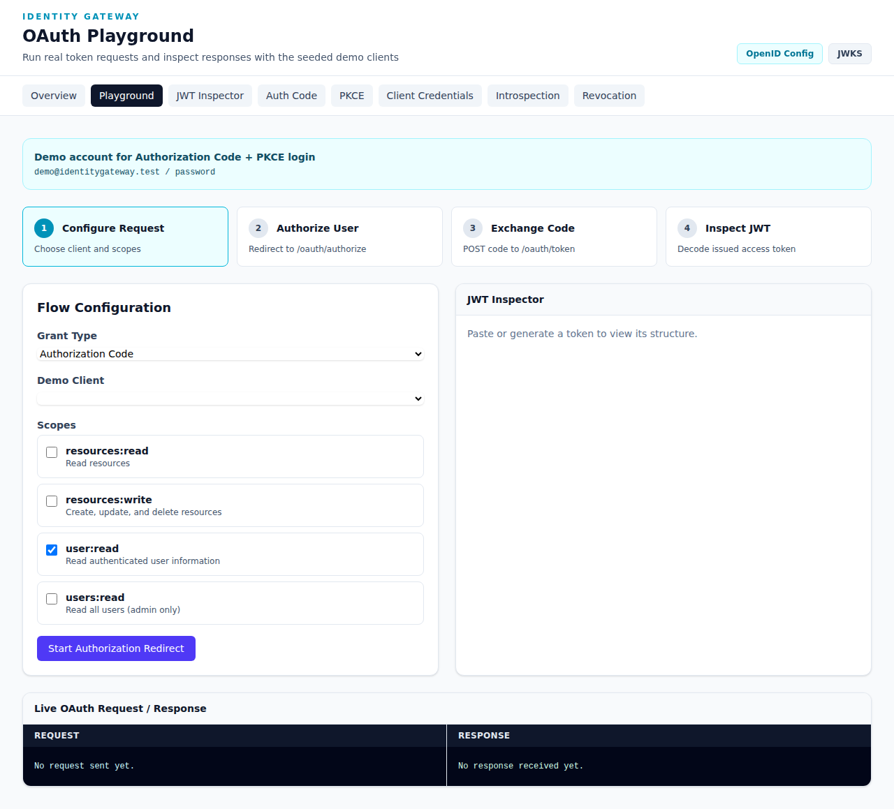

# OAuth Playground

The **OAuth Playground** is an interactive tool for running real OAuth2 token requests and inspecting responses with seeded demo clients.

**URL**: `http://192.168.50.60:8000/demo/playground`

## Overview

The playground allows you to test three OAuth2 grant types:
- **Authorization Code** - Browser-based user authentication
- **Authorization Code + PKCE** - Enhanced security for public clients
- **Client Credentials** - Machine-to-machine authentication

**Live Demo URL**: `http://192.168.50.60:8000/demo/playground`

## How to Use

### Step 1: Configure Request

1. **Select Grant Type** from the dropdown:
   - `Authorization Code` - For confidential server-side apps
   - `Authorization Code + PKCE` - For mobile/SPA apps
   - `Client Credentials` - For backend services

2. **Select Demo Client** from the client dropdown

3. **Choose Scopes** by checking the desired permissions:
   - `resources:read` - Read resources
   - `resources:write` - Create, update, delete resources
   - `user:read` - Read user information
   - `users:read` - Read all users (admin only)

### Step 2: Start the Flow

Click the **"Start Authorization Redirect"** button to begin.

#### For Authorization Code / PKCE:
- You will be redirected to the login page
- Use demo credentials: `demo@identitygateway.test` / `password`
- Approve the consent screen
- The playground will automatically exchange the code for tokens

#### For Client Credentials:
- The token request is sent immediately
- Response appears in the "Live OAuth Request / Response" panel

### Step 3: Inspect Results

The **JWT Inspector** panel on the right displays:
- Decoded JWT header
- Payload (claims)
- Signature verification status

The **Request/Response** panel at the bottom shows:
- Full HTTP request sent
- Server response with tokens
- Error details (if any)

## Flow Steps Explained

The playground visualizes a 4-step process:

1. **Configure Request** - Choose client and scopes
2. **Authorize User** - Redirect to `/oauth/authorize`
3. **Exchange Code** - POST code to `/oauth/token`
4. **Inspect JWT** - Decode issued access token

## Demo Credentials

For Authorization Code and PKCE flows:
- **Email**: `demo@identitygateway.test`
- **Password**: `password`

## Tips

- The playground saves the last generated token - use it in other demos
- Check the "Live OAuth Request / Response" panel to see exact HTTP exchanges
- Use different scope combinations to see how access varies
- Try all three grant types to understand their differences
