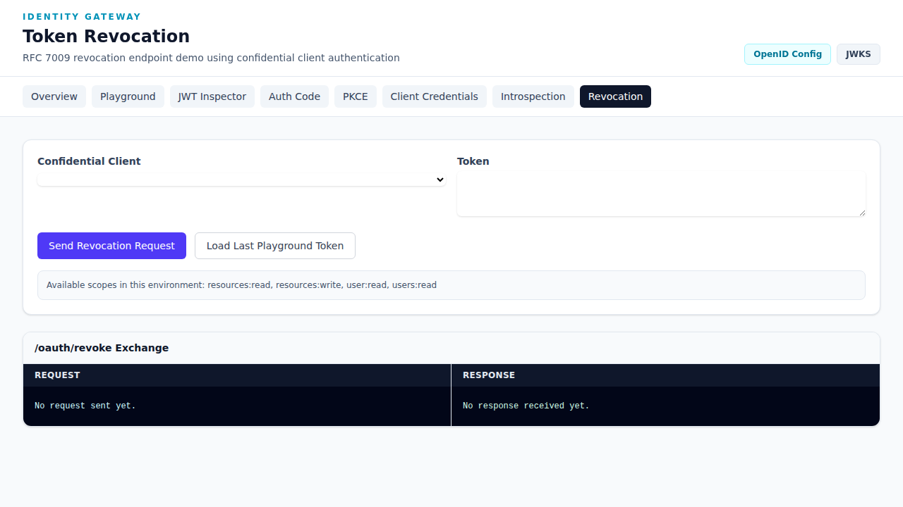

# Token Revocation

The **Token Revocation** demo allows you to revoke tokens using RFC 7009 and validate deactivation behavior.

**URL**: `http://192.168.50.60:8000/demo/revocation`



## Overview

Token revocation allows clients and administrators to invalidate access tokens before their natural expiration, essential for security incident response and user logout scenarios.

### RFC 7009

This demo implements RFC 7009 - OAuth 2.0 Token Revocation, which defines a method for clients to notify the authorization server that a previously obtained refresh or access token is no longer needed.

## How to Use

### Step 1: Configure the Request

1. **Select Confidential Client** from the dropdown
   - Choose a client with revocation permissions
   - The client will authenticate via HTTP Basic auth

2. **Enter Token** in the Token field
   - Paste the access token you want to revoke
   - Or click **"Load Last Playground Token"** to use the most recent token

### Step 2: Send the Revocation Request

Click **"Send Revocation Request"**

### Step 3: Verify Revocation

After revocation:
1. Go to the [Token Introspection](./introspection.md) page
2. Load the same token
3. Verify it shows `"active": false`

## Revocation Request/Response

### Request

```bash
curl -X POST http://192.168.50.60:8000/oauth/revoke \
  -u "CLIENT_ID:CLIENT_SECRET" \
  -d "token=ACCESS_TOKEN"
```

### Response

**Success (HTTP 200):**
```http
HTTP/1.1 200 OK
Content-Type: application/json

{}
```

The server returns an empty JSON object on success (as per RFC 7009).

### Full Exchange

**Request:**
```http
POST /oauth/revoke HTTP/1.1
Host: 192.168.50.60:8000
Authorization: Basic ZGVtbzpkZW1v
echo "Content-Type: application/x-www-form-urlencoded"

token=eyJhbGciOiJSUzI1NiIs...
```

**Response:**
```http
HTTP/1.1 200 OK
Content-Type: application/json

{}
```

## Available Scopes

The demo environment shows available scopes at the bottom of the page:
- `resources:read`
- `resources:write`
- `users:read`
- `users:read`

## When to Use Token Revocation

Use token revocation for:
- 🔐 **User Logout** - Revoke tokens when user signs out
- 🔐 **Security Incidents** - Revoke compromised tokens
- 🔐 **Permission Changes** - Revoke when user permissions change
- 🔐 **Token Rotation** - Revoke old tokens during rotation
- 🔐 **Session Management** - Implement secure session timeouts

### Common Scenarios

| Scenario | Action |
|----------|--------|
| User logout | Revoke all tokens for the user |
| Suspected breach | Revoke all tokens for affected client |
| Permission downgrade | Revoke and reissue with new scopes |
| Device lost/stolen | Revoke tokens for that device |

## Verification Workflow

After revoking a token, verify it's truly inactive:

```
1. Revoke Token          2. Introspect Token
   POST /oauth/revoke  ─────▶  POST /oauth/introspect
   Response: {}        │      Response: {"active": false}
                       │
                       ▼
             3. Token is now INVALID
```

### Verification Steps

1. Revoke the token in this demo
2. Navigate to **Introspection** demo
3. Enter the same token
4. Click "Send Introspection Request"
5. Confirm response shows `"active": false`

## Security Best Practices

- 🔒 Revoke tokens immediately on logout
- 🔒 Implement token revocation in your security incident response plan
- 🔒 Use short-lived tokens to minimize exposure window
- 🔒 Log all revocation events for audit purposes
- 🔒 Consider automatic revocation on suspicious activity

## Implementation in Your Application

### Logout Flow

```javascript
// Client-side logout
async function logout() {
  // 1. Revoke the access token
  await fetch('/oauth/revoke', {
    method: 'POST',
    headers: {
      'Authorization': 'Basic ' + btoa('client_id:client_secret'),
      'Content-Type': 'application/x-www-form-urlencoded'
    },
    body: 'token=' + accessToken
  });

  // 2. Clear local storage
  localStorage.removeItem('access_token');
  localStorage.removeItem('refresh_token');

  // 3. Redirect to login
  window.location.href = '/login';
}
```

### Backend Revocation

```python
import requests

def revoke_token(token, client_id, client_secret):
    response = requests.post(
        'http://192.168.50.60:8000/oauth/revoke',
        auth=(client_id, client_secret),
        data={'token': token}
    )
    return response.status_code == 200
```

## Tips

- Always verify revocation with introspection during testing
- The revocation endpoint is at `/oauth/revoke`
- Both access tokens and refresh tokens can be revoked
- Revocation is immediate and irreversible
- Use "Load Last Playground Token" for quick testing

## Related Demos

- [Token Introspection](./introspection.md) - Verify token revocation
- [OAuth Playground](./playground.md) - Generate tokens to revoke
- [JWT Inspector](./jwt-inspector.md) - Examine tokens before revocation
